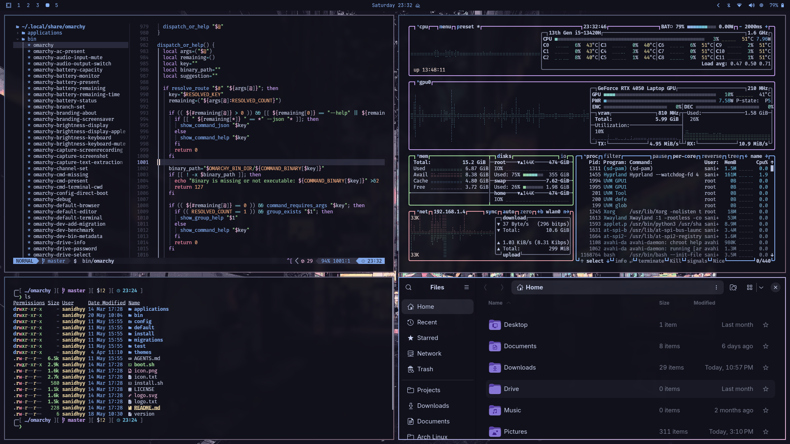
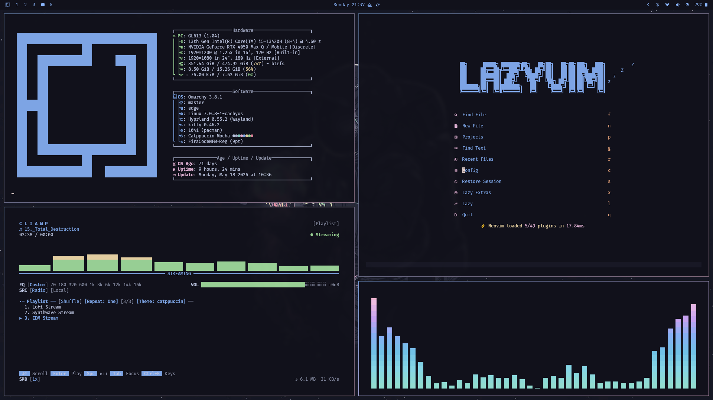
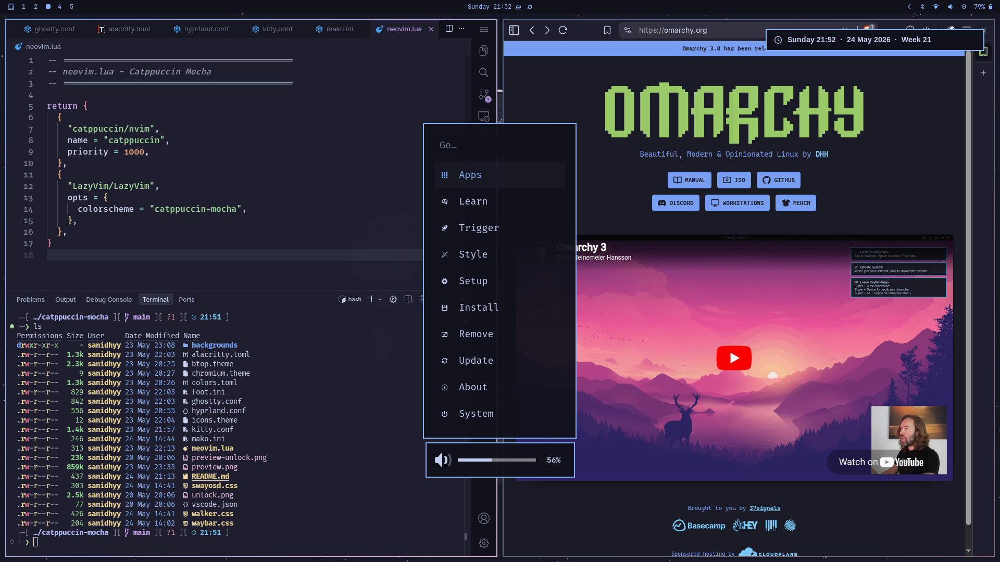
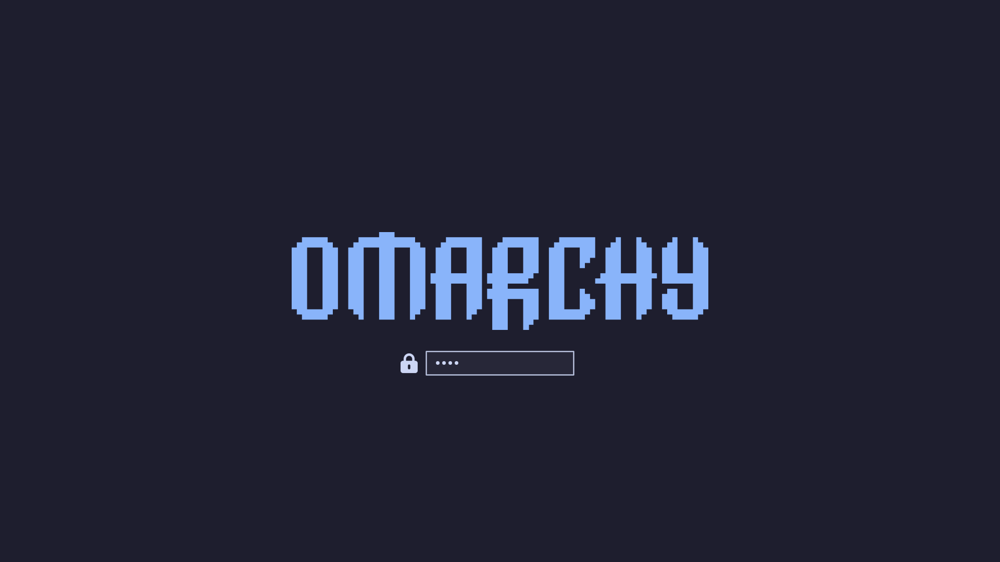

# :smiley_cat: Catppuccin Mocha Theme for Omarchy

A refined, darker Catppuccin Mocha theme for [Omarchy](https://omarchy.org "Omarchy by DHH"), with deeper backgrounds and vibrant accents.



## :rocket: Installation

```bash
omarchy theme install https://github.com/sanidhyy/omarchy-catppuccin-mocha-theme.git
```

Or use the menu: **Menu → Install → Style → Theme** → paste the repo URL.

### :lock: Unlock theme (Plymouth)

After installing the theme, you can also apply the matching unlock theme:

```bash
omarchy plymouth set by theme catppuccin-mocha
```

Or use the menu: **Menu → Style → Unlock**.

## :camera: Preview







## :gear: Update / Remove

```bash
omarchy theme update # or Menu → Update → Extra Themes
omarchy theme remove catppuccin-mocha # or Menu → Remove → Theme
```

## :sparkles: Credits

- [DHH](https://x.com/dhh "David Heinemeier Hansson") & the Omarchy team for the excellent project.
- [Catppuccin](https://github.com/catppuccin "Catppuccin Mocha") community for the beautiful palette and ecosystem.

## :page_with_curl: License and Third-Party Notes

- This repository contains original modifications and adapted configurations from upstream projects.
- All third-party assets (palettes, tools, wallpapers) retain their original licenses and copyrights.
- If you are the creator of any wallpaper in the `backgrounds/` folder and would like it removed or credited, please [Contact me](https://sanidhyy.name/#contact "Contact me at my email or through this form.").

## :house: Dotfiles

I use this theme in my dotfiles, you can find them [here](https://github.com/sanidhyy/dotfiles "My dotfiles").
